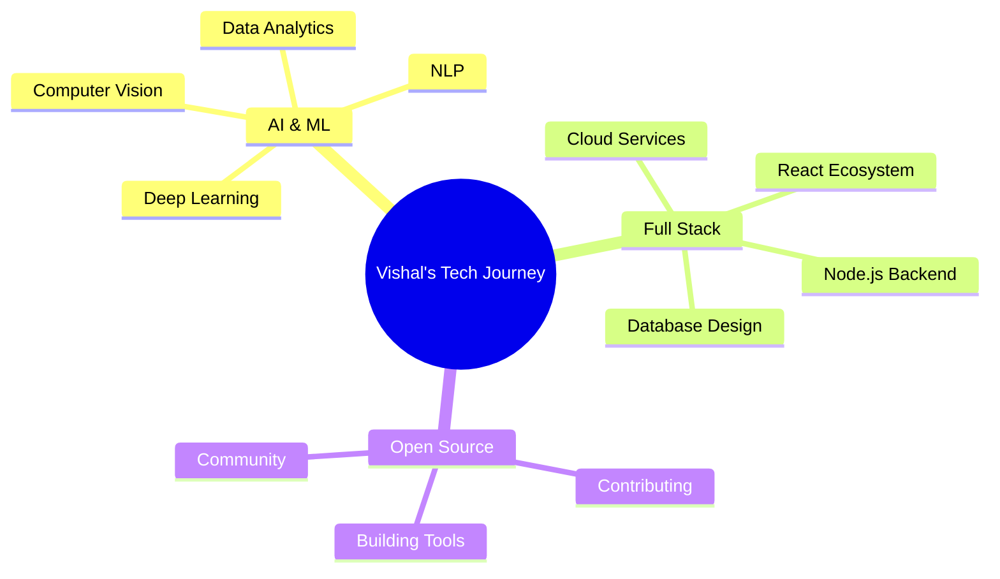

<div align="center">

# 💫 Welcome to My Digital Realm


<p align="center">
  
</p>

```ascii
╔═══════════════════════════════════════════════════════════════╗
║  "Building intelligent systems that bridge code and cognition" ║
╚═══════════════════════════════════════════════════════════════╝
```

</div>

---

## 🚀 About Me

```typescript
const vishal = {
    location: "India 🇮🇳",
    role: "AI/ML Engineer & Full Stack Developer",
    currentFocus: ["Artificial Intelligence", "Machine Learning", "Data Analytics"],
    workingOn: "AI-powered applications & scalable web solutions",
    communities: {
        github: "@VishalCodesX",
        linkedin: "vishaltinsightsaiml"
    },
    funFact: "Did you know? Game of Thrones Night's Watch cloaks are Ikea rugs! ⚔️",
    motto: "Code with purpose, innovate with passion"
};
```

<div align="center">

### 💬 Let's Connect

[](mailto:vichu29122005@gmail.com)
[](https://www.linkedin.com/in/vishaltinsightsaiml)
[](https://vishal-portfolio-omega-tawny.vercel.app/)

</div>

---

## 🛠️ Tech Arsenal

<div align="center">

### Frontend Development


### Backend & Database


### AI/ML & Data Science


### Tools & Others


</div>

---

## 📊 GitHub Analytics

<div align="center">
  
  
</div>

<div align="center">
  
  
</div>

<br/>

<div align="center">
  
</div>

---

## 🏆 GitHub Trophies

<div align="center">
  
</div>

---

## 🎯 Current Focus

<div align="center">



</div>

---

## 💡 Featured Projects

<div align="center">

| 🚀 Project | 📝 Description | 🛠️ Tech Stack |
|------------|----------------|----------------|
| **AI Assistant** | Intelligent chatbot with NLP capabilities | Python, TensorFlow, Flask |
| **Task Manager Pro** | Full-stack productivity application | React, Node.js, MySQL |
| **Data Viz Dashboard** | Real-time analytics platform | Next.js, D3.js, Supabase |

> 📌 *Check out my pinned repositories below for more amazing projects!*

</div>

---

## 📈 Contribution Snake

<div align="center">
  
</div>

---

## 💰 Support My Work

<div align="center">

If you find my projects helpful or interesting, consider supporting my work!

[](https://ko-fi.com/V7V4RAK9C)


*Your support helps me create more awesome open-source projects! ☕*

</div>

---

<div align="center">

### 📫 Let's Build Something Amazing Together!


**⭐ From [VishalCodesX](https://github.com/VishalCodesX) with 💙**

</div>
